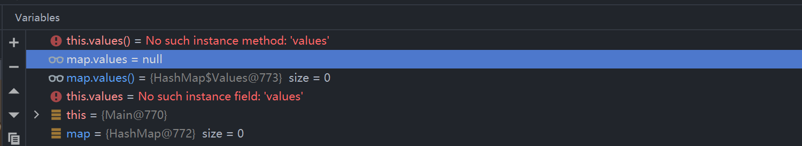
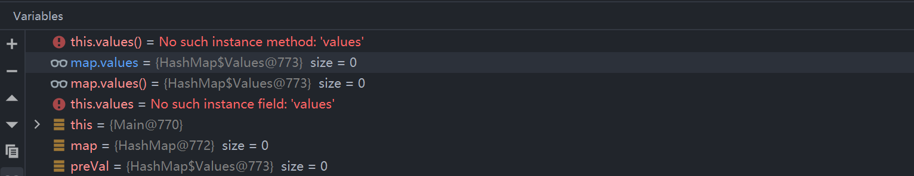
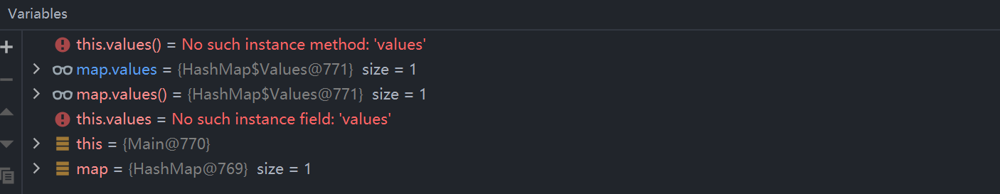
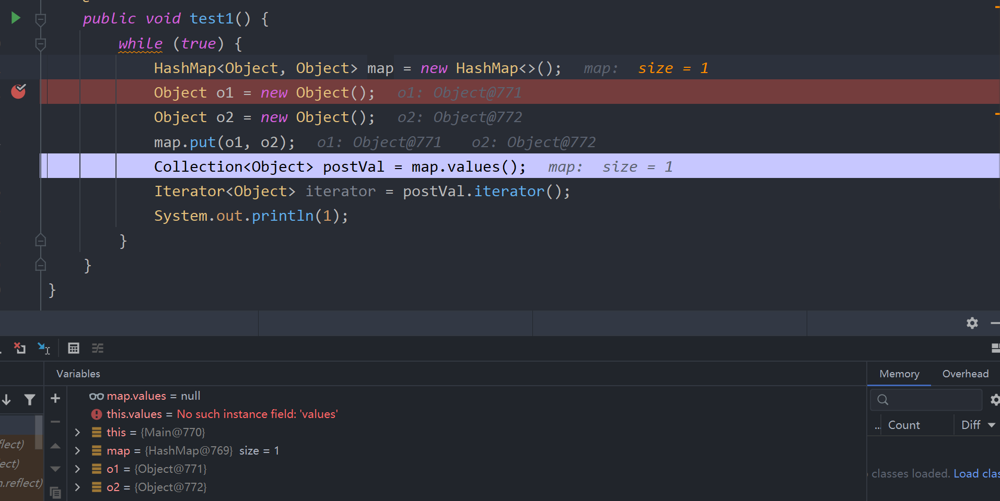
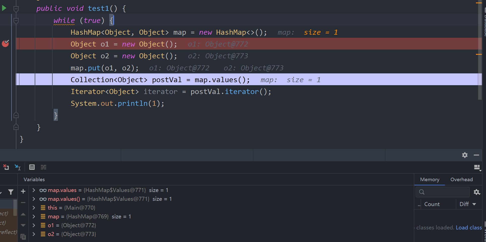
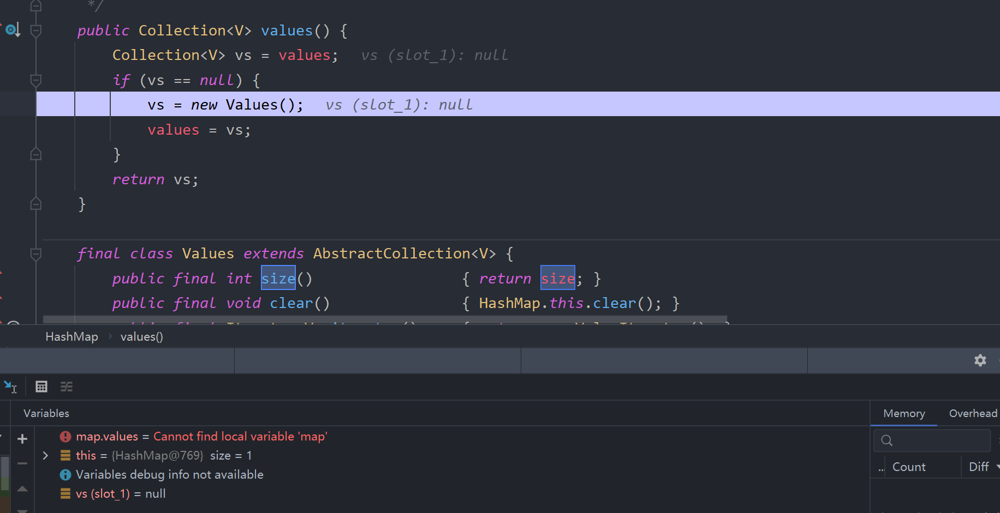

# HashMap 的 values() 方法探索

1. 先看示例代码

   ```java
   public class Main {
       @Test
       public void test1(){
           HashMap<String, String> map = new HashMap<>(); 		----1
           Collection<String> preVal = map.values();			----2
           map.put("a","aa");									----3
           Collection<String> postVal = map.values();			----4
       }
   }
   ```

1完成时： map初始化完成的时候，此时values为null



2完成时： 调用values()方法，此时进行values字段初始化



当我们把--2删掉，即

```java
public class Main {
    @Test
    public void test1(){
        HashMap<String, String> map = new HashMap<>(); 		----1
        map.put("a","aa");									----3
        Collection<String> postVal = map.values();			----4
    }
}
```

当--3完成时，可以发现没有调用values()方法，values字段也被初始化了




此时就遇到了一个debug的坑了。

## 经过一晚上的思考，试着解答一下遇到的问题：

1. 为什么values字段有时候会莫名奇妙就不为null？是谁把他初始化了？

   因为使用了idea的debug功能监听了map.values()，虽然是idea的辅助功能，但他还是影响了数据，导致初始化了values字段，从而在看起来比较随机的时间就把null更新了。（map.values()出现的相同问题同理）

   当把map.values()监听关掉之后，就可以发现map.values一直为null。

   下图为对比测试：






2. 排除了异常情况，现在再分析values到底是什么时候初始化的？

猜测：调用values()方法的时候才初始化

原因是因为values字段可以看作是keySet的马甲，keySet又是table的马甲，values并不**"真正"**存取数据

>  虽然可以remove数据，但他只是因为有数据的引用，间接操作，数据的最终归属还是属于hashMap

values类又是hashMap的内部类，可以读取hashMap的数据，也即可以把values看作是hashMap的一个函数工具类。

那么values在什么时候初始化就不是那么关键了。无论什么时候初始化，早或晚，使用values类内部方法得到的数据都是一样的（因为是hashMap数据的引用）。所以我们猜测values是懒加载，用的时候才加载。

下图也间接证明了这一点：

